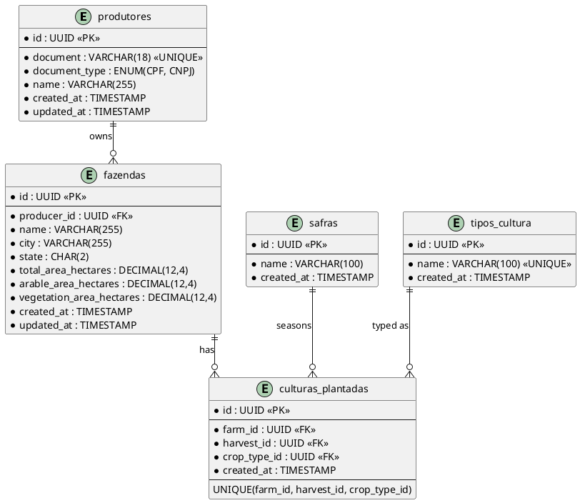

# Feature Specification: Brain Agriculture — Sistema de Gerenciamento de Produtores Rurais

> Status: Draft
> Branch: spec/brain-agriculture-fullstack-20260526130553
> Created: 2026-05-26
> Author: Ricardo Sousa

---

## 1. Overview

### 1.1 Description

Brain Agriculture is a fullstack web application for managing the registration of rural producers and their properties. The system allows users to create, read, update, and delete records of rural producers, their farms, harvests, and planted crops. A dashboard provides aggregated visualizations of registered data.

The application is containerized and runs via Docker Compose with three separate containers: frontend, backend, and database. It is intended to be used as a demonstration of fullstack engineering skills covering backend API design, database modeling, frontend state management, testing, and documentation.

### 1.2 Objectives

- Provide a reliable and user-friendly interface for registering and managing rural producers.
- Enforce domain-specific business rules (CPF/CNPJ validation, area constraints).
- Offer a dashboard with quantitative and visual summaries of the registered data.
- Demonstrate clean, well-tested, documented fullstack code following industry best practices.

### 1.3 Stakeholders

| Role | Interest |
|------|----------|
| Rural Producer Manager | Manages producer and farm registrations |
| System Administrator | Monitors application health and data integrity |
| Evaluating Developer | Reviews code quality, architecture, and practices |

---

## 2. Context and Background

This system is a technical evaluation project (teste tecnico) for Brain Agriculture. It must demonstrate the ability to:

- Interpret business requirements and translate them into a working system.
- Apply object-oriented and clean code principles.
- Build a scalable, testable, and observable application.
- Produce clear documentation for developers and stakeholders.

There is no existing codebase; the application is built from scratch.

---

## 3. Ubiquitous Language / Glossary

| Term (PT) | Term (EN) | Definition |
|-----------|-----------|------------|
| Produtor Rural | Rural Producer | Individual or legal entity owning one or more farms. Identified by CPF or CNPJ. |
| Fazenda / Propriedade Rural | Farm / Rural Property | A land unit owned by a producer with defined total, arable, and vegetation areas. |
| Safra | Harvest | A season/year period in which crops are planted on a farm. Example: Safra 2021. |
| Cultura | Crop Type | A type of agricultural crop. Examples: Soja, Milho, Cafe, Cana de Acucar, Algodao. |
| Cultura Plantada | Planted Crop | A specific crop planted in a specific harvest on a specific farm. |
| Area Total | Total Area | Total area of the farm in hectares. |
| Area Agricultavel | Arable Area | Cultivable area of the farm in hectares. |
| Area de Vegetacao | Vegetation Area | Area reserved for native vegetation in hectares. |
| CPF | CPF | Cadastro de Pessoa Fisica — Brazilian individual taxpayer identification (11 digits). |
| CNPJ | CNPJ | Cadastro Nacional de Pessoa Juridica — Brazilian company taxpayer identification (14 digits). |
| Dashboard | Dashboard | Summary screen with aggregated totals and charts. |

---

## 4. User Stories

### US-01: Register a Rural Producer

**As a** rural producer manager,
**I want** to register a new rural producer with their CPF or CNPJ,
**So that** I can maintain an up-to-date registry of producers in the system.

**Acceptance Criteria:**
- Given a valid CPF or CNPJ, when I submit the registration form, then the producer is saved and appears in the producers list.
- Given an invalid CPF or CNPJ, when I submit the form, then I see a clear validation error message and the record is not saved.
- Given an already registered CPF or CNPJ, when I submit the form, then I see a duplication error.

---

### US-02: Register a Farm for a Producer

**As a** rural producer manager,
**I want** to register one or more farms for a producer,
**So that** I can track the properties associated with each producer.

**Acceptance Criteria:**
- Given a registered producer, when I add a farm with valid area values, then the farm is saved linked to that producer.
- Given area values where arable + vegetation area exceeds total area, when I try to save, then I see a validation error and the farm is not saved.
- A producer may have zero, one, or many farms registered.

---

### US-03: Register Planted Crops per Harvest

**As a** rural producer manager,
**I want** to register which crops were planted in each harvest on a farm,
**So that** I can track agricultural production history per farm.

**Acceptance Criteria:**
- Given a farm, when I register a harvest with one or more crops, then the planted crops are saved and associated to that farm and harvest.
- A farm may have zero, one, or many planted crops per harvest.
- Multiple crop types can be planted in the same harvest on the same farm.

---

### US-04: Edit a Rural Producer

**As a** rural producer manager,
**I want** to edit the data of an existing producer or their farms,
**So that** I can keep the records accurate and up to date.

**Acceptance Criteria:**
- Given an existing producer, when I update their data with valid information, then the changes are saved and reflected in the system.
- Business rules (CPF/CNPJ validation, area constraints) are enforced on edit as well as on creation.

---

### US-05: Delete a Rural Producer

**As a** rural producer manager,
**I want** to delete a producer from the system,
**So that** I can remove outdated or incorrect registrations.

**Acceptance Criteria:**
- Given an existing producer, when I confirm deletion, then the producer and all their associated farms and crop data are removed from the system.
- The system asks for confirmation before deleting.

---

### US-06: View the Dashboard

**As a** rural producer manager,
**I want** to see a dashboard with aggregated statistics,
**So that** I can quickly understand the current state of registered data.

**Acceptance Criteria:**
- The dashboard displays the total number of registered farms.
- The dashboard displays the total registered hectares (sum of all total areas).
- The dashboard shows a pie chart with farm distribution by Brazilian state.
- The dashboard shows a pie chart with distribution by planted crop type.
- The dashboard shows a pie chart with land use distribution (arable area vs. vegetation area).
- All dashboard data reflects the current state when new producers, farms, or crops are added, edited, or deleted.

---

## 5. Functional Requirements

### FR-01: CRUD for Rural Producers

**Description:** The system must allow creating, reading, updating, and deleting rural producers. A producer record contains: document (CPF or CNPJ), document type, and full name.
**Priority:** High
**User Stories:** US-01, US-04, US-05

### FR-02: CPF/CNPJ Validation

**Description:** The system must validate CPF (11 digits) and CNPJ (14 digits) using the official Brazilian algorithmic validation (check digits). Formatting characters (dots, dashes, slashes) must be accepted and stripped before validation. The document must be mathematically valid, not just have the correct length. Known invalid sequences (e.g., all same digit) must be rejected.
**Priority:** High
**User Stories:** US-01, US-04

### FR-03: Farm Registration per Producer

**Description:** The system must allow registering one or more farms for a producer. Each farm contains: name, city, state (Brazilian UF), total area in hectares, arable area in hectares, and vegetation area in hectares.
**Priority:** High
**User Stories:** US-02

### FR-04: Area Constraint Validation

**Description:** When registering or editing a farm, the system must validate that the sum of arable area and vegetation area does not exceed the total area of the farm. If violated, the record must not be saved and a clear error message must be shown to the user.
**Priority:** High
**User Stories:** US-02, US-04

### FR-05: Planted Crops per Harvest

**Description:** The system must allow registering planted crops per harvest for a given farm. A harvest is identified by a name/year (e.g., "Safra 2021"). Multiple crop types (e.g., Soja, Milho, Cafe, Cana de Acucar, Algodao) may be planted in the same harvest on the same farm.
**Priority:** High
**User Stories:** US-03

### FR-06: Dashboard Statistics

**Description:** The system must display a dashboard with the following aggregated information:
- Total number of registered farms (count).
- Total registered area in hectares (sum of all farms total area).
- Pie chart: distribution of farms by Brazilian state.
- Pie chart: distribution of planted crops by crop type.
- Pie chart: land use distribution across all farms (arable area vs. vegetation area).
**Priority:** High
**User Stories:** US-06

### FR-07: Producers List View

**Description:** The system must display a list of all registered producers with key information (name, CPF/CNPJ, number of farms). The list must support viewing full details of each producer.
**Priority:** High
**User Stories:** US-01, US-04, US-05

---

## 6. Business Rules

### BR-01: CPF/CNPJ Format and Check Digit Validation

The CPF must contain 11 numeric digits and pass the official two-step check digit algorithm. The CNPJ must contain 14 numeric digits and pass the official CNPJ check digit algorithm. Known invalid sequences (e.g., all digits identical: "111.111.111-11") must be rejected even if the check digit happens to pass. The system must accept identifiers with or without formatting characters and validate the underlying digits.

### BR-02: Area Constraint

For any farm registration or update, the following invariant must always hold:

Arable Area + Vegetation Area <= Total Area

If this constraint is violated, the operation must be rejected with a descriptive, user-friendly error message. This rule applies on creation and on every update.

### BR-03: Producer Document Uniqueness

A CPF or CNPJ may not be registered more than once in the system. Attempting to register a duplicate document must result in a clear error message.

### BR-04: Producer-Farm Cardinality

A producer may be associated with zero, one, or many farms. Deleting a producer must cascade and remove all associated farms and planted crops.

### BR-05: Farm-Crop Cardinality

A farm may have zero, one, or many planted crops per harvest. A single harvest on a single farm may have multiple different crop types.

### BR-06: Brazilian States

The state field must be a valid Brazilian state abbreviation (UF), one of the 26 states plus the Federal District (DF). Total: 27 valid values (AC, AL, AP, AM, BA, CE, DF, ES, GO, MA, MT, MS, MG, PA, PB, PR, PE, PI, RJ, RN, RS, RO, RR, SC, SP, SE, TO).

---

## 7. Non-Functional Requirements

### Performance
- The producers list must load in under 3 seconds with up to 10,000 registered producers.
- Dashboard statistics must be computed and displayed in under 5 seconds.
- Standard CRUD operations must complete in under 2 seconds from the user's perspective.

### Reliability
- Data entered through the interface must be persisted reliably; no silent data loss.
- Constraint violations must be communicated clearly to the user and never silently ignored.

### Observability
- The backend must produce structured logs for all HTTP requests (method, path, status code, response time).
- Business rule violations (invalid CPF/CNPJ, area constraint breach) must be logged at WARN level.
- Database connection errors and unhandled exceptions must be logged at ERROR level with sufficient detail for diagnosis.

### Usability
- Validation errors must be displayed inline next to the relevant form fields.
- Destructive operations (delete) must require explicit user confirmation.
- The dashboard must be accessible from the main navigation at all times.

### Portability
- The entire application must run with a single docker-compose up command on any machine with Docker installed.
- No manual environment setup steps beyond copying a .env.example to .env.

### Documentation
- A README.md must provide complete setup instructions (prerequisites, environment variables, how to run, how to run tests).
- The REST API must be documented via OpenAPI (Swagger), accessible at a known URL when the application is running.
- An Entity-Relationship diagram must document the database schema.

### Testability
- Backend services must have unit tests covering all business rules (CPF/CNPJ validation, area constraint).
- Frontend components must have unit tests for critical UI flows (forms, store).
- Mock/seed data must be available for all test scenarios.

### Maintainability
- Code must follow SOLID principles, KISS, and Clean Code standards.
- Architecture must use clear layered separation (controller, service, repository).
- No business logic in controllers or in the data access layer.

---

## 8. Data Model

### 8.1 Entities

#### Producer (produtores)

| Attribute | Type | Description | Constraints |
|-----------|------|-------------|-------------|
| id | UUID | Unique identifier | PK, generated |
| document | VARCHAR(18) | CPF or CNPJ (raw digits stored, no formatting) | NOT NULL, UNIQUE |
| document_type | ENUM('CPF','CNPJ') | Type of document | NOT NULL |
| name | VARCHAR(255) | Full name of the producer | NOT NULL |
| created_at | TIMESTAMP | Record creation time | NOT NULL |
| updated_at | TIMESTAMP | Last update time | NOT NULL |

#### Farm (fazendas)

| Attribute | Type | Description | Constraints |
|-----------|------|-------------|-------------|
| id | UUID | Unique identifier | PK, generated |
| producer_id | UUID | Owner producer | FK to produtores, NOT NULL |
| name | VARCHAR(255) | Name of the farm | NOT NULL |
| city | VARCHAR(255) | City where farm is located | NOT NULL |
| state | CHAR(2) | Brazilian state abbreviation (UF) | NOT NULL |
| total_area_hectares | DECIMAL(12,4) | Total farm area in hectares | NOT NULL, > 0 |
| arable_area_hectares | DECIMAL(12,4) | Arable/cultivable area | NOT NULL, >= 0 |
| vegetation_area_hectares | DECIMAL(12,4) | Vegetation reserved area | NOT NULL, >= 0 |
| created_at | TIMESTAMP | Record creation time | NOT NULL |
| updated_at | TIMESTAMP | Last update time | NOT NULL |

Business constraint: arable_area_hectares + vegetation_area_hectares <= total_area_hectares

#### Harvest (safras)

| Attribute | Type | Description | Constraints |
|-----------|------|-------------|-------------|
| id | UUID | Unique identifier | PK, generated |
| name | VARCHAR(100) | Harvest name/year (e.g., "Safra 2021") | NOT NULL |
| created_at | TIMESTAMP | Record creation time | NOT NULL |

#### CropType (tipos_cultura)

| Attribute | Type | Description | Constraints |
|-----------|------|-------------|-------------|
| id | UUID | Unique identifier | PK, generated |
| name | VARCHAR(100) | Crop name (e.g., "Soja", "Milho", "Cafe") | NOT NULL, UNIQUE |

#### PlantedCrop (culturas_plantadas)

| Attribute | Type | Description | Constraints |
|-----------|------|-------------|-------------|
| id | UUID | Unique identifier | PK, generated |
| farm_id | UUID | Farm where the crop is planted | FK to fazendas, NOT NULL |
| harvest_id | UUID | Harvest season | FK to safras, NOT NULL |
| crop_type_id | UUID | Type of crop | FK to tipos_cultura, NOT NULL |
| created_at | TIMESTAMP | Record creation time | NOT NULL |

Unique constraint: (farm_id, harvest_id, crop_type_id) — the same crop cannot be planted twice in the same harvest on the same farm.

### 8.2 Relationships

- Producer has 0 to N Farms (one-to-many)
- Farm has 0 to N PlantedCrops (one-to-many)
- Harvest has 0 to N PlantedCrops (one-to-many)
- CropType has 0 to N PlantedCrops (one-to-many)

### 8.3 Entity-Relationship Diagram



---

## 9. REST API Contract

### Base URL: /api/v1

### Producers

| Method | Path | Description |
|--------|------|-------------|
| GET | /rural-producers | List all producers |
| GET | /rural-producers/:id | Get producer by ID (with farms) |
| POST | /rural-producers | Create a new producer |
| PATCH | /rural-producers/:id | Update producer |
| DELETE | /rural-producers/:id | Delete producer (cascade) |

### Farms

| Method | Path | Description |
|--------|------|-------------|
| GET | /rural-producers/:producerId/farms | List farms for a producer |
| GET | /farms/:id | Get farm by ID (with planted crops) |
| POST | /farms | Create a new farm |
| PATCH | /farms/:id | Update farm |
| DELETE | /farms/:id | Delete farm |

### Harvests

| Method | Path | Description |
|--------|------|-------------|
| GET | /harvests | List all harvests |
| POST | /harvests | Create a harvest |

### Crop Types

| Method | Path | Description |
|--------|------|-------------|
| GET | /crop-types | List all crop types |
| POST | /crop-types | Create a crop type |

### Planted Crops

| Method | Path | Description |
|--------|------|-------------|
| GET | /farms/:farmId/planted-crops | List planted crops for a farm |
| POST | /planted-crops | Register a planted crop |
| DELETE | /planted-crops/:id | Remove a planted crop |

### Dashboard

| Method | Path | Description |
|--------|------|-------------|
| GET | /dashboard/stats | Get aggregated dashboard statistics |

Dashboard response shape:
```json
{
  "totalFarms": 42,
  "totalHectares": 125430.5,
  "farmsByState": [
    { "state": "MT", "count": 15 },
    { "state": "GO", "count": 12 }
  ],
  "farmsByCropType": [
    { "cropType": "Soja", "count": 20 },
    { "cropType": "Milho", "count": 18 }
  ],
  "landUse": {
    "totalArableArea": 87000.0,
    "totalVegetationArea": 38430.5
  }
}
```

Standard error response format:
```json
{
  "statusCode": 422,
  "message": "A soma das areas agricultavel e de vegetacao nao pode exceder a area total da fazenda",
  "error": "Unprocessable Entity"
}
```

---

## 10. User Flows

### Flow 1: Register a New Producer with a Farm and Crops

1. User navigates to "Produtores" and clicks "Novo Produtor".
2. User fills in producer name and CPF or CNPJ.
3. System validates CPF/CNPJ; shows inline error if invalid.
4. User submits the producer form.
5. System saves the producer and navigates to the producer detail screen.
6. User clicks "Adicionar Fazenda".
7. User fills in farm name, city, state, total area, arable area, and vegetation area.
8. System validates the area constraint; shows inline error if violated.
9. User saves the farm.
10. User clicks "Adicionar Cultura" on the farm.
11. User selects a harvest (or creates a new one) and selects one or more crop types.
12. System saves the planted crops.

Alternative — Invalid Document: at step 3, the form displays inline: "CPF invalido" or "CNPJ invalido". The form may not be submitted until corrected.

Alternative — Area Violation: at step 8, the form displays: "A soma das areas agricultavel e de vegetacao nao pode exceder a area total da fazenda."

---

### Flow 2: Edit a Producer's Farm

1. User navigates to the producer detail screen.
2. User clicks "Editar" on a specific farm.
3. System loads the edit form pre-populated with current values.
4. User changes area values.
5. System re-validates the area constraint on submit.
6. System saves the updated farm and reflects changes on the detail screen.

---

### Flow 3: Delete a Producer

1. User clicks "Excluir" on a producer in the list.
2. System shows a confirmation dialog: "Tem certeza? Todos os dados associados a este produtor serao removidos permanentemente."
3. User confirms deletion.
4. System deletes the producer, their farms, and all associated planted crops.
5. User is redirected to the producers list.

---

### Flow 4: View Dashboard

1. User navigates to "Dashboard" from the main navigation.
2. System fetches aggregated statistics from the API.
3. System displays:
   - Counter card: total number of farms.
   - Counter card: total hectares registered.
   - Pie chart: distribution of farms by Brazilian state.
   - Pie chart: distribution of planted crop types.
   - Pie chart: land use (arable area vs. vegetation area).
4. Charts show labels and values on hover.

---

## 11. System Architecture

### High-Level Architecture

```
+----------------------------------------------------------+
|                    Docker Compose                        |
|                                                          |
|  +--------------+    HTTP      +----------------------+  |
|  |   Frontend   | -----------> |      Backend         |  |
|  |   (React)    |   REST API   |     (NestJS)         |  |
|  |   Port 3000  |              |      Port 3001       |  |
|  +--------------+              +----------+-----------+  |
|                                           | TypeORM      |
|                               +-----------v-----------+  |
|                               |     PostgreSQL        |  |
|                               |      Port 5432        |  |
|                               +-----------------------+  |
+----------------------------------------------------------+
```

### Backend Layered Architecture

```
HTTP Request
     |
     v
+-------------+
|  Controller |  <- Route handling, request/response mapping, input DTOs
+------+------+
       |
       v
+-------------+
|   Service   |  <- Business logic, validation (CPF/CNPJ, area), orchestration
+------+------+
       |
       v
+-------------+
| Repository  |  <- Data access via TypeORM entities and queries
+------+------+
       |
       v
+-------------+
|  PostgreSQL |  <- Persistent data store
+-------------+
```

### Frontend Architecture (Atomic Design + Redux)

```
User Action
     |
     v
React Component (Atom / Molecule / Organism / Page)
     |
     v
Redux Action / Thunk
     |
     v
API Service Layer (fetch/axios calls)
     |
     v
REST API (Backend)
     |
     v (response)
Redux Store Update
     |
     v
React Component Re-render
```

---

## 12. Acceptance Criteria

### AC-01: Producer CRUD

- [ ] A new producer is created with a valid CPF or CNPJ and a name.
- [ ] A producer can be retrieved by ID, including their associated farms.
- [ ] The list of all producers can be retrieved.
- [ ] An existing producer's name and document can be updated.
- [ ] Deleting a producer also removes all their farms and planted crops.

### AC-02: CPF Validation

- [ ] A valid CPF (e.g., 529.982.247-25) is accepted.
- [ ] An invalid CPF with wrong check digits is rejected with an error message.
- [ ] A CPF with all identical digits (e.g., 111.111.111-11) is rejected.
- [ ] CPF with and without formatting characters is handled correctly.

### AC-03: CNPJ Validation

- [ ] A valid CNPJ is accepted.
- [ ] An invalid CNPJ is rejected with an error message.
- [ ] A CNPJ with all identical digits is rejected.
- [ ] CNPJ with and without formatting characters is handled correctly.

### AC-04: Farm Area Constraint

- [ ] A farm where arable area + vegetation area equals total area is accepted.
- [ ] A farm where arable area + vegetation area is less than total area is accepted.
- [ ] A farm where arable area + vegetation area exceeds total area is rejected with a specific error message.
- [ ] The area constraint is enforced on farm updates, not only on creation.

### AC-05: Multiple Farms per Producer

- [ ] A producer can be saved with zero farms.
- [ ] A producer can have more than one farm registered.
- [ ] Each farm is independently editable and deletable.

### AC-06: Multiple Crops per Farm/Harvest

- [ ] A farm can have zero planted crops.
- [ ] A farm can have multiple crop types registered in the same harvest.
- [ ] A farm can have crops registered across multiple different harvests.

### AC-07: Dashboard

- [ ] Dashboard shows the correct total count of registered farms.
- [ ] Dashboard shows the correct total sum of all farms total areas in hectares.
- [ ] Dashboard shows a pie chart of farms grouped by Brazilian state.
- [ ] Dashboard shows a pie chart of planted crops grouped by crop type.
- [ ] Dashboard shows a pie chart of land use (total arable area vs. total vegetation area).
- [ ] Dashboard data reflects additions and deletions without requiring a manual page refresh.

### AC-08: Docker Compose

- [ ] Running docker-compose up starts all three containers (frontend, backend, database) without manual intervention.
- [ ] The frontend is accessible in a browser after startup.
- [ ] The backend API responds to requests after startup.
- [ ] The database persists data across container restarts via a Docker volume.

### AC-09: API Documentation

- [ ] Swagger UI is accessible at a documented URL when the backend is running.
- [ ] All API endpoints are listed in Swagger with request body and response schemas.

### AC-10: Testing

- [ ] Backend has unit tests for CPF validation logic.
- [ ] Backend has unit tests for CNPJ validation logic.
- [ ] Backend has unit tests for farm area constraint.
- [ ] Backend has integration tests for producer CRUD endpoints.
- [ ] Frontend has unit tests for producer form validation.
- [ ] Frontend has unit tests for Redux producers slice.
- [ ] All tests pass when running the test command.

### AC-11: README

- [ ] README documents prerequisites (Docker version, etc.).
- [ ] README documents how to start the application with docker-compose up.
- [ ] README includes a .env.example with all required environment variables.
- [ ] README documents how to run tests for both frontend and backend.

### AC-12: Logging and Observability

- [ ] Every HTTP request to the backend is logged with method, path, status code, and response time.
- [ ] Business rule violations produce a log entry at WARN level.
- [ ] Unhandled errors are logged at ERROR level with a stack trace.

---

## 13. Requirements Checklist (Full Coverage)

### Business Requirements

- [ ] BR-REQ-01: Users can create, edit, and delete rural producers.
- [ ] BR-REQ-02: CPF and CNPJ are validated using the official Brazilian check digit algorithm.
- [ ] BR-REQ-03: Arable area + vegetation area never exceeds total farm area.
- [ ] BR-REQ-04: Multiple crop types can be registered per farm per harvest.
- [ ] BR-REQ-05: A producer can have 0, 1, or more farms.
- [ ] BR-REQ-06: A farm can have 0, 1, or more planted crops per harvest.
- [ ] BR-REQ-07a: Dashboard shows total number of registered farms.
- [ ] BR-REQ-07b: Dashboard shows total registered hectares.
- [ ] BR-REQ-07c: Dashboard shows pie chart of farms by Brazilian state.
- [ ] BR-REQ-07d: Dashboard shows pie chart by crop type.
- [ ] BR-REQ-07e: Dashboard shows pie chart of land use (arable vs. vegetation).

### Backend Technical Requirements

- [ ] BACK-REQ-01: REST API implemented with NestJS + TypeScript.
- [ ] BACK-REQ-02: Application distributed via Docker.
- [ ] BACK-REQ-03: PostgreSQL used as the database.
- [ ] BACK-REQ-04: All business requirement endpoints are implemented.
- [ ] BACK-REQ-05: Unit tests written and passing.
- [ ] BACK-REQ-06: Integration tests written and passing.
- [ ] BACK-REQ-07: Mock/seed data available for test scenarios.
- [ ] BACK-REQ-08: Structured logging implemented for observability.
- [ ] BACK-REQ-09: TypeORM used as the ORM.

### Frontend Technical Requirements

- [ ] FRONT-REQ-01: Application built with TypeScript + ReactJS.
- [ ] FRONT-REQ-02: Redux used for application state management.
- [ ] FRONT-REQ-03: Unit tests written with Jest + React Testing Library.
- [ ] FRONT-REQ-04: Mock data structured for test scenarios.
- [ ] FRONT-REQ-05: Components structured using Atomic Design pattern (atoms, molecules, organisms, templates, pages).
- [ ] FRONT-REQ-06: CSS-in-JS implemented with Styled Components or Emotion.

### Documentation Requirements

- [ ] DOC-REQ-01: README with clear setup instructions (prerequisites, run command, test command, environment variables).
- [ ] DOC-REQ-02: OpenAPI (Swagger) specification accessible from running application.
- [ ] DOC-REQ-03: Entity-Relationship diagram of the database schema.
- [ ] DOC-REQ-04: Architecture diagram included (as ASCII or image).

### Engineering Principles Requirements

- [ ] PRIN-REQ-01: SOLID principles applied throughout the codebase.
- [ ] PRIN-REQ-02: KISS principle followed (no unnecessary complexity).
- [ ] PRIN-REQ-03: Clean Code practices applied (meaningful names, small functions, no dead code).
- [ ] PRIN-REQ-04: API Contracts defined and documented via OpenAPI.
- [ ] PRIN-REQ-05: Layered architecture implemented (Controller -> Service -> Repository).

### Infrastructure Requirements

- [ ] INFRA-REQ-01: Docker Compose with 3 separate containers (frontend, backend, database).
- [ ] INFRA-REQ-02: Application starts fully with a single docker-compose up command.

### Bonus (Optional)

- [ ] BONUS-01: Application deployed to the cloud and accessible via a public internet URL.
- [ ] BONUS-02: Context API used as a complement to Redux.
- [ ] BONUS-03: Microfrontend structure implemented.

---

## 14. Out of Scope

The following are explicitly NOT included in this specification:

- User authentication and authorization (no login system required for the MVP).
- Multi-tenancy (single-user system).
- File uploads (e.g., farm photos, scanned documents).
- Email notifications.
- Real-time data updates via WebSockets.
- Mobile-native application.
- Advanced reporting beyond the five specified dashboard metrics.
- Integration with any external agricultural, government, or mapping APIs.
- Payment processing.
- Role-based access control.

---

## 15. Open Questions

| # | Question | Status |
|---|----------|--------|
| 1 | Should CropType be a fixed enum (seeded at startup) or user-managed (allow creating new crop types)? Suggested: pre-seed common types (Soja, Milho, Cafe, Cana de Acucar, Algodao) but allow creation. | Open |
| 2 | Should Harvest be a fixed set per year or freely created by the user with a custom name? Suggested: freely created, stored as a name string. | Open |
| 3 | Is pagination required on the producers list for the MVP? | Open |
| 4 | Should the document uniqueness check (BR-03) apply globally across all producers? Suggested: yes, globally. | Open |
| 5 | Should deleting a CropType or Harvest that is in use be blocked, or cascade delete? Suggested: block with an error message. | Open |
